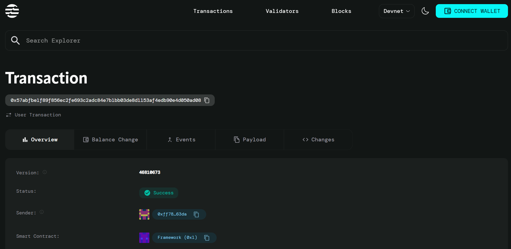

# Multi-Sig Wallet

## Project Description

A decentralized multi-signature wallet smart contract built on the Aptos blockchain that enables secure management of digital assets through configurable signature thresholds. This implementation allows multiple parties to collectively control a wallet, requiring a predetermined number of signatures before any transaction can be executed, providing enhanced security and shared ownership capabilities.

## Project Vision

To create a robust, secure, and user-friendly multi-signature wallet solution that empowers organizations, DAOs, and collaborative groups to manage their digital assets with enhanced security through distributed control. Our vision is to eliminate single points of failure in cryptocurrency management while maintaining simplicity and efficiency in the user experience.

## Key Features

- **Configurable Threshold**: Set custom signature requirements (m-of-n) based on your security needs
- **Multiple Owner Support**: Add multiple wallet owners with equal transaction proposal rights  
- **Secure Transaction Approval**: Transactions require multiple confirmations before execution
- **Replay Attack Prevention**: Built-in nonce system prevents transaction replay attacks
- **Balance Management**: Real-time tracking of wallet balance and transaction history
- **Owner Verification**: Only authorized owners can propose and approve transactions
- **Atomic Execution**: Transactions execute automatically once threshold is reached
- **Gas Efficient**: Optimized Move code for minimal transaction costs
- **Transparent Operations**: All approvals and transactions are recorded on-chain
- **Flexible Architecture**: Easily extendable for additional features and integrations

## Future Scope

- **Advanced Permission System**: Role-based access control with different permission levels
- **Time-locked Transactions**: Support for delayed execution and scheduling capabilities  
- **Multi-token Support**: Extend beyond AptosCoin to support various token standards
- **Emergency Recovery**: Implement secure recovery mechanisms for lost owner access
- **Mobile Integration**: Native mobile app for seamless wallet management
- **Hardware Wallet Support**: Integration with popular hardware wallet providers
- **Governance Features**: Built-in voting mechanisms for wallet parameter changes
- **Analytics Dashboard**: Comprehensive transaction analytics and reporting tools
- **Cross-chain Compatibility**: Bridge functionality for multi-blockchain operations
- **Smart Contract Integration**: Support for automated DeFi protocol interactions
- **Audit Trail**: Enhanced logging and compliance features for institutional users
- **Batch Transactions**: Execute multiple transactions simultaneously for efficiency

## Contract Details
0x57abfbe1f89f856ec2fe693c2adc84e7b1bb03de8d1153af4edb90e4d050ad08
